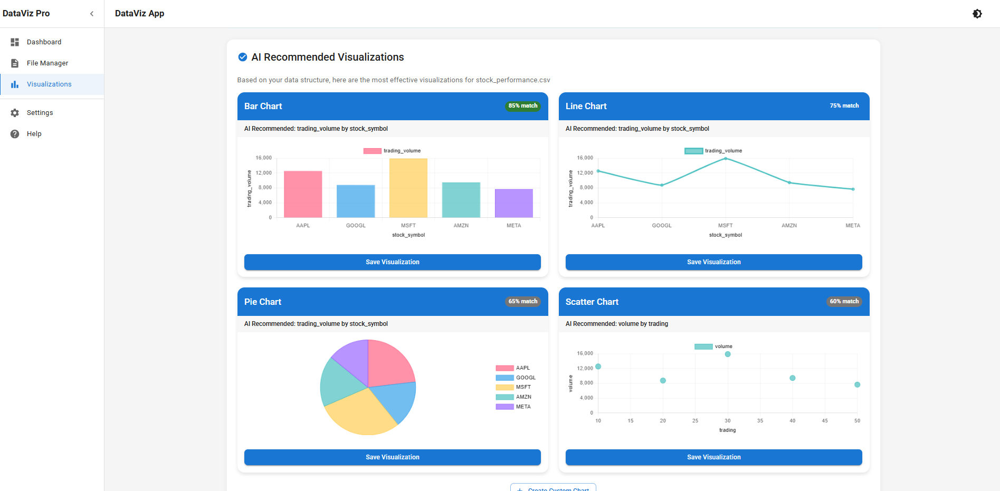

# DataViz Pro

A powerful web-based data visualization tool that automates the process of creating meaningful visualizations from your data. DataVizPro helps you transform raw data into insightful, interactive charts and graphs with AI-powered recommendations.

## ✨ Features

- 📊 **Smart File Upload & Storage** - Support for CSV, JSON, and Excel files with automatic schema detection
- 🔍 **Automated Data Analysis** - Intelligent analysis of your data to identify patterns, correlations, and outliers
- 📈 **Dynamic Visualization Generation** - Automatically create the most suitable visualizations based on your data
- 🎨 **Data Filtering & Customization** - Fine-tune your visualizations with advanced filtering and styling options
- 🤖 **AI-Driven Chart Recommendations** - Get smart suggestions for the best chart types for your specific data
- 🔄 **Real-time Updates** - See changes reflected immediately as you modify your data or visualization settings
- 📱 **Responsive Design** - Works seamlessly across desktop and mobile devices

## 🖼️ Screenshots

### Dashboard Overview


### Data Upload & Management


### AI Chart Recommendations


### Visualization Workspace


## 🛠️ Tech Stack

- **Frontend**: React.js with Material-UI for a modern, responsive interface
- **Backend**: Node.js with Express for a robust API layer
- **Database**: MongoDB for flexible data storage
- **Visualization**: Chart.js and D3.js for powerful, interactive charts
- **AI/ML**: TensorFlow.js for intelligent chart recommendations
- **Authentication**: JWT-based user authentication system

## ⚙️ Prerequisites

- Node.js (v14 or higher)
- MongoDB
- npm or yarn

## 🚀 Setup Instructions

1. Clone the repository
   ```bash
   git clone https://github.com/aaditya-desai1/hackathon.git
   cd hackathon
   ```

2. Install dependencies:
   ```bash
   # Install backend dependencies
   cd backend
   npm install

   # Install frontend dependencies
   cd ../frontend
   npm install
   ```

3. Create a `.env` file in the backend directory with:
   ```
   MONGODB_URI=your_mongodb_uri
   PORT=5000
   JWT_SECRET=your_jwt_secret
   ```

4. Start the development servers:
   ```bash
   # Start backend server
   cd backend
   npm run dev

   # Start frontend server
   cd ../frontend
   npm start
   ```

5. Open your browser and navigate to `http://localhost:3000`

## 📁 Project Structure

```
dataviz-pro/
├── backend/
│   ├── controllers/  # Request handlers
│   ├── models/       # Database schemas
│   ├── routes/       # API routes
│   ├── services/     # Business logic
│   └── utils/        # Helper functions
├── frontend/
│   ├── public/       # Static files
│   └── src/
│       ├── components/  # UI components
│       ├── pages/       # Application pages
│       ├── services/    # API communication
│       └── utils/       # Helper functions
└── README.md
```

## 🧪 Testing

Run tests with:
```bash
# Backend tests
cd backend
npm test

# Frontend tests
cd frontend
npm test
```

## 🤝 Contributing

Contributions are welcome! Please feel free to submit a Pull Request.

1. Fork the repository
2. Create your feature branch (`git checkout -b feature/amazing-feature`)
3. Commit your changes (`git commit -m 'Add some amazing feature'`)
4. Push to the branch (`git push origin feature/amazing-feature`)
5. Open a Pull Request

## 📧 Contact

Project Link: [https://github.com/aaditya-desai1/Hackathon.git](https://github.com/aaditya-desai1/Hackathon.git)

## Authentication

The application supports both traditional email/password authentication and Google Sign-In:

### Setup Google Authentication

1. Create a project in the [Google Cloud Console](https://console.cloud.google.com/)
2. Configure the OAuth consent screen
3. Create OAuth credentials (Web application type)
4. Add your domain to the authorized JavaScript origins (e.g., `http://localhost:3000` for local development and your production domain)
5. Add the client ID to the following files:
   - `frontend/.env` and `frontend/.env.production`: Set `REACT_APP_GOOGLE_CLIENT_ID=your-client-id`
   - `backend/.env`: Set `GOOGLE_CLIENT_ID=your-client-id` and `GOOGLE_CLIENT_SECRET=your-client-secret`
6. For Vercel deployment, add the following environment variables:
   - `GOOGLE_CLIENT_ID`
   - `GOOGLE_CLIENT_SECRET`

### Deploying to Vercel

For the application to work correctly on Vercel, make sure to set the following environment variables in your Vercel project:

- `MONGODB_URI`: Your MongoDB connection string
- `JWT_SECRET`: A secure string for JWT token generation
- `GOOGLE_CLIENT_ID`: Your Google OAuth client ID
- `GOOGLE_CLIENT_SECRET`: Your Google OAuth client secret

You can add these as environment variables in the Vercel project settings or use the Vercel CLI: 